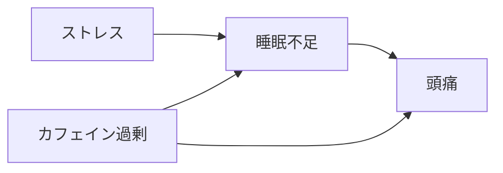
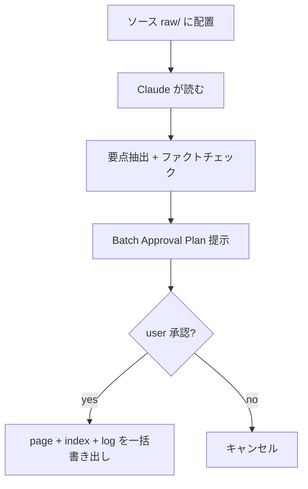
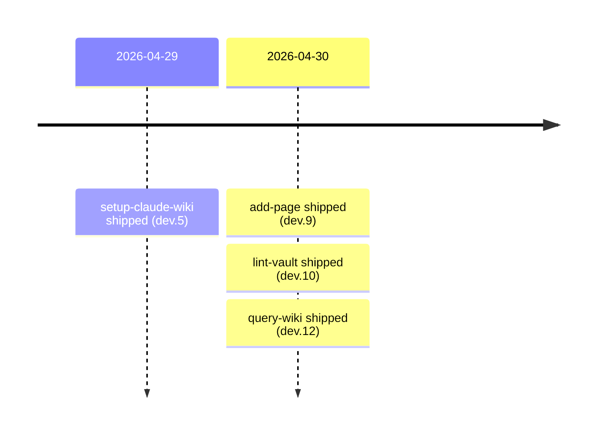
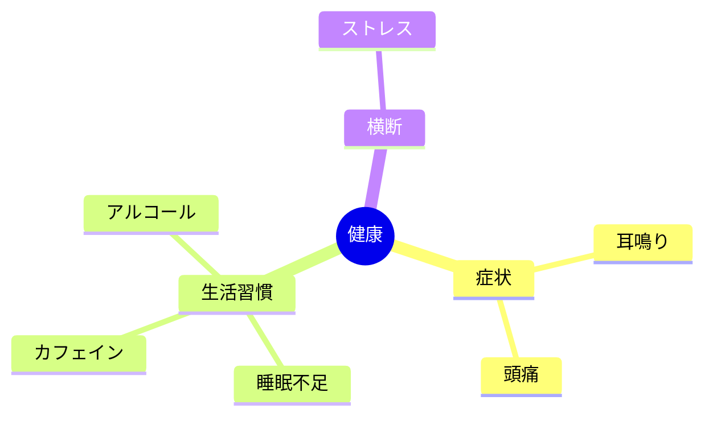

# Query a claude-wiki vault (hybrid reading, citations, graduation)

> Answers questions against the vault using a Karpathy-canonical reading order (index → wiki-index → wiki-page) with an obsidian-cli grep fallback. Synthesizes across pages with inline `[[Page]]` citations. Auto-offers graduation when the answer has reuse value, re-using `add-page`'s Batch Approval flow to file it back as a wiki page with a `query→wiki` log prefix.

## Behavior summary

The skill walks through six steps:

0. **Dependency gate** — verify kepano/obsidian-skills installed and Obsidian app running
1. **Question parse + scope** — detect domain hints, optional path/domain restriction
2. **Hybrid vault walk** — index-first chain + grep fallback for missed keywords
3. **Synthesize answer** — markdown body + inline citations + optional comparison table + optional Mermaid diagram + `## Sources`
4. **Graduation auto-offer** — propose filing back as a wiki page when canonical criteria are met (3+ sources, new framing, or likely re-asked)
5. **Return answer** with optional graduation link (or proceed to add-page Batch Approval flow if user accepts)

The skill **only writes** when the user accepts a graduation; otherwise it is purely read + synthesize.

---

## Step 0 — Dependency gate

Identical to `add-page` and `lint-vault` Step 0.

### 0.1 — kepano/obsidian-skills installed?

```bash
obsidian help 2>&1 | head -1
```

If missing, instruct the user to install kepano/obsidian-skills via Cowork and stop.

### 0.2 — Obsidian app running?

```bash
obsidian read path="README.md" 2>&1 | head -1
```

If `Vault not found`, prompt the user to launch Obsidian and stop. Last-resort fallback uses Glob/Grep/Read tool only if user explicitly opts in (degraded mode skips Step 2's grep fallback that depends on `obsidian search`).

---

## Step 1 — Question parse + scope

Parse the user's question to determine:

### 1.1 — Domain hints

If the question references a known domain (e.g., 健康, 仕事, パーソナル), restrict Step 2's index walk to that domain's wiki-index. Otherwise, default to whole vault.

Detection: the user may write `/query-wiki 健康: 頭痛と耳鳴りの共通の誘因は？` or simply say "健康ドメインで…" inline. Both are valid scope hints.

### 1.2 — Output format intent (visualization triggers)

Scan the question for explicit visualization cues that auto-activate Step 3 special outputs:

**Comparison table triggers:** `vs`, `比較`, `違い`, `差異`, `〜と〜の違い`, `一覧`, `〜別`, `compare`, `difference between`, `tabulate`, `tabular`

**Mermaid diagram triggers:** `〜の流れ`, `〜のフロー`, `〜の関係`, `〜のタイムライン`, `図解して`, `視覚的に`, `図示して`, `可視化して`, `flow`, `flowchart`, `diagram`, `visualize`, `timeline of`, `relationship between`, `show graph`

When neither trigger is present, default to plain markdown body + `## Sources`.

### 1.3 — Re-question detection

If a previous query already produced a graduated page covering the same topic (search wiki-index summaries + page titles for substantial overlap), surface that page first:

> 既に [[<existing-page>]] にこの質問への回答が wiki 化されています。再度合成しますか？ 既存ページをそのまま開いてもよいですし、新しい情報だけ補強する形 (delta) も可能です。どうしましょう？

`open existing` returns the existing page link. `補強 (delta only)` proceeds with new sources only and offers an UPDATE-style graduation in Step 4. v0.1.0 keeps this lightweight — exact-question matching is best-effort.

---

## Step 2 — Hybrid vault walk

### 2.1 — Locale & vault state (re-use add-page Step 2.1)

`obsidian properties counts format=tsv` → JP keys vs EN keys majority vote → locale lock for citations and graduation page output.

### 2.2 — Index-first walk

Read in order, with question keywords as the relevance filter:

1. **Vault root** `README.md` — detect available top-level domains
2. **Root indexes** (`type: root-index` / `タイプ: ルート索引`) — typically Inbox, システム, パーソナル, 仕事 — read summary lines, identify candidate sub-domains
3. **Wiki indexes** (`type: wiki-index` / `タイプ: 索引`) under candidate domains — read `## ページ` / `## Pages` summary lines to find candidate wiki pages
4. **Wiki pages** (`type: wiki-page` / `タイプ: wikiページ`) — read full bodies of candidates

Apply the **3-pass strategy** from `add-page` Step 2.2 to avoid the obsidian-cli colon-operator parse error: broad search → glob fallback → frontmatter verify.

Total reads should stay under ~10 pages for most queries. If candidates exceed that, prefer the most-recently-updated pages and note the truncation in `## Sources`.

### 2.3 — Grep fallback

After the index walk, identify keywords from the question that did not surface meaningful citations through the index chain. For each:

```bash
obsidian search query="<keyword>"
obsidian search:context query="<keyword>"
```

Read up to 3 additional pages from the search hits to fill gaps. This catches inline mentions in pages whose `summary` did not advertise the keyword.

### 2.4 — Citation tracking

For each substantive claim that will appear in the answer, record:

```
{
  "claim": "<paraphrase>",
  "source": "<page-path>",
  "section": "<heading or paragraph hint>",
  "verbatim": <true if exact-quote, false if paraphrase>
}
```

This becomes the basis for inline `[[Page]]` citations and the `## Sources` summary. Track only sources actually used — don't list every page touched during the walk.

### 2.5 — Backlinks for context

For each candidate source page, optionally run:

```bash
obsidian backlinks file="<page>"
```

Pages that link *to* the candidates are often relevant peers (e.g., a page about [[ストレス]] backlinked by [[頭痛]] and [[耳鳴り]] suggests cross-cutting relevance). Add to candidate set and re-rank. Cap at 1-2 backlink hops to avoid runaway expansion.

---

## Step 3 — Synthesize answer

### 3.1 — Body composition

Write a markdown answer that:

1. Opens with a 1-2 sentence direct response to the question
2. Expands with structured sections (use `## Subheading` if the answer is non-trivial)
3. **Inline citations:** sprinkle `[[Page-Name]]` next to claims that derive from a specific page. Multiple sources for one claim → multiple inline wikilinks: `主因は加齢性難聴 [[耳鳴り]] [[頭痛]]`. Do **not** convert peer mentions into footnotes — keep citations inline so they remain grep-friendly and integrate with Obsidian's backlinks.
4. Ends with a `## Sources` (JP: `## 出典`) section listing every source page as a wikilink, optionally with a 1-line context note

### 3.2 — Comparison table (when triggered)

When a comparison/difference/list trigger fires (Step 1.2), render a markdown table immediately after the prose introduction:

```markdown
緊張型頭痛と片頭痛の主な違いをまとめます。

| | 緊張型頭痛 | 片頭痛 |
|:--|:--|:--|
| 痛みの性質 | 締め付けられる | 拍動性 |
| 部位 | 両側 | 片側 |
| 重症度 | 軽〜中等度 | 中〜重度 |
| 主誘因 | ストレス・姿勢 | 食物・ホルモン |
| 急性期治療 | NSAIDs / アセトアミノフェン | トリプタン / ジタン / ゲパント |

Sources: [[頭痛]]
```

Keep the column count manageable (2-4 columns typically). For 3-way or larger comparisons, list each entity as a row with attributes as columns.

Each row's claim should be traceable to a source listed below the table.

### 3.3 — Mermaid diagram (when triggered)

When a flow/relationship/timeline/visualization trigger fires (Step 1.2), render a Mermaid block. Pick the diagram type that fits the question:

**Concept relationships** (`〜の関係`, `relationship between`):

````markdown

````

**Process flow** (`〜の流れ`, `flow`):

````markdown

````

**Timeline** (`〜のタイムライン`, `timeline of`):

````markdown

````

**Mind map** (organizing concepts):

````markdown

````

Mermaid syntax follows the Obsidian native renderer (it uses Mermaid 10+). When unsure about the diagram type, default to `graph LR` for relationships or `flowchart TD` for processes.

Each Mermaid block should be followed by a one-line "Sources: [[Page-1]] [[Page-2]] …" so provenance stays visible without the diagram having to encode it.

### 3.4 — Confidence and gaps

After the body, if relevant, append a 1-2 line note about coverage:

> 補足: 急性期治療は [[頭痛]] 由来。予防薬の項は [[頭痛]] L72-78 に記載があるが、トリプタン禁忌の最新ガイドラインは vault 内に未収録。最新情報は別途調査推奨。

This honors Karpathy's spirit — the wiki tells you what it knows AND what it doesn't.

### 3.5 — `## Sources` section

Always end the answer with:

```markdown
## Sources
- [[耳鳴り]] (主症状の定義、誘因、対処)
- [[頭痛]] (一次性 vs 二次性、red flag)
- [[ストレス]] (HPA 軸、対処法)
```

Each entry is a wikilink to a touched page, with an optional 1-line context note. Order by relevance (most-cited first), not alphabetically.

---

## Step 4 — Graduation auto-offer

### 4.1 — Criteria detection

Auto-offer graduation when **any** of:

- **3+ sources synthesized**: the `## Sources` list has 3+ pages contributing substantive content
- **New framing**: the answer introduces a comparison, distinction, or framing that doesn't exist in any single source page (e.g., a 3-way table that no individual page contains)
- **Likely re-asked**: the question is generic enough that the same or adjacent question is plausible (e.g., "X と Y の違い", "X の選び方", "X の対処法まとめ")

If **none** are met (e.g., a one-source quick lookup), do not offer graduation — the answer simply returns to the user's chat.

### 4.2 — Proposal prompt

When criteria are met, surface the offer at the end of the answer:

```markdown
💡 この回答は再利用価値があります (3+ sources を統合):
  - 該当 sources: [[耳鳴り]], [[頭痛]], [[ストレス]], [[カフェイン]]
  - 提案 title: [[頭痛の誘因マップ]]
  - 配置先: プライベート/健康/

[[頭痛の誘因マップ]] として保存しましょうか？ 別のタイトルがよければ教えてください。やめておく場合もそう伝えてもらえれば OK です。
```

Title generation:
- Derive a noun-phrase title from the question (e.g., "頭痛の誘因をまとめて" → `頭痛の誘因マップ`)
- Avoid question-shaped titles (`頭痛とは？` → `頭痛の概要`)
- Use locale-appropriate phrasing
- If the user provides `別タイトル <title>`, use that

Placement:
- Default: the most-cited source's parent domain (e.g., if 頭痛 / 耳鳴り / ストレス all live under プライベート/健康/, place there)
- If sources span multiple domains, default to the **largest-source-count** domain and let user redirect
- For cross-cutting topics, system or another root-index location may be appropriate — surface the user's choice in the prompt

### 4.3 — Graduation flow (when user accepts)

When the user accepts (はい / お願い / yes / proceed / 任意の affirmative):

1. Hand off to `add-page` Batch Approval Plan flow with these pre-filled values:
   - `mode = from-scratch` (the answer is the body)
   - `topic = <proposed title>`
   - `target domain = <chosen placement>`
   - `body = <answer body, including any tables/Mermaid blocks>`
   - `frontmatter sources = []` (or populated if any `[[raw/...]]` were referenced)
   - `frontmatter 関連/contexts = <source pages, parent excluded>`

2. The Batch Approval Plan from `add-page` will show:
   - CREATE: `[[<proposed title>]]`
   - UPDATE: each source page's `## 関連` to add `[[<proposed title>]]` (bidirectional sync per `add-page` Step 5.4)
   - INDEX: parent wiki-index `## ページ` append
   - LOG: append with **`query→wiki` prefix** (not `ingest`):

     ```markdown
     ## [YYYY-MM-DD] query→wiki | <title>
     - Created: [[<title>]]
     - Based on: [[Source-1]], [[Source-2]], [[Source-3]]
     - Triggered by: <one-line summary of the originating query>
     ```

3. Confirmation tree from `add-page` Step 6 displays the saved page + bidirectional updates

If the user proposes a different title (e.g.「別のタイトルにしたい」「もっと短く」「<new title> で」), re-prompt with the revised title and confirm.

If the user declines (skip / やめる / 不要 / 任意の negative), return the answer to chat as-is. The query stays in chat history but is not persisted in the wiki.

### 4.4 — When NOT to auto-offer

Skip the graduation prompt when:

- Single-source lookup (1 source, simple fact retrieval): too thin for a wiki page
- The answer is a corrective/clarification of an existing page (the user should `add-page` UPDATE that page directly, not create a new one)
- The user's question is meta or process-related (`/query-wiki` の使い方は？)

In these cases, just return the answer.

---

## Step 5 — Return answer

Final output to the user:

1. **Answer body** (Step 3)
2. **Graduation prompt** (Step 4) if criteria met
3. **No additional summary** — the answer is the deliverable

If the user accepts graduation, after the add-page write pass completes, the saved page link (`computer://...`) is shown in the confirmation tree from add-page Step 6, and the original query stays linked via the log entry.

---

## Frontmatter rules (apply to graduated pages only)

When graduation produces a new page, the frontmatter follows `add-page` exactly:

```yaml
---
"タイプ": wikiページ
"タグ": []
"カテゴリ": ["[[<parent-wiki-index>]]"]
"ステータス": 下書き
"更新日": 'YYYY-MM-DD'
"まとめ": "<derived from question / answer>"
"出典": []  # populated if [[raw/...]] sources cited
"関連": ["[[<source-1>]]", "[[<source-2>]]", ...]  # source pages, parent excluded
"エイリアス": []
---
```

Per the Frontmatter rules in `add-page` SKILL.md:
- JP keys quoted; EN keys unquoted
- Date strings always quoted
- `関連` populated from the `## Sources` list (bare wikilinks, parent wiki-index excluded)
- No `cssclasses`

---

## Out of scope (deferred to v0.1.1+)

- **Marp slide deck output** — canvas + slide formats deferred; markdown/table/Mermaid covers ~80% of synthesis needs
- **Matplotlib chart output** — requires Python tooling; out of plugin scope
- **Obsidian canvas (.canvas) output** — kepano `json-canvas` skill exists but multi-format query output adds significant complexity
- **Multi-turn refinement** — follow-up questions in same chat that build on previous query (re-using cached vault walk)
- **Cached query results** — same/near-same question returns previously-graduated page directly without re-walking
- **Confidence scoring** — quantitative coverage scores beyond the prose note in Step 3.4
- **Cross-vault federated query** — only single vault for v0.1.0
- **Conversation persistence** — query history beyond what `lint-log.md` and graduation `query→wiki` log entries capture

---

## Implementation notes

- **Read-mostly**: the skill writes nothing until Step 4.3 graduation accepted. Steps 0-3 are pure read + synthesize.
- **Token economy**: large vaults can produce many candidate pages. Cap reads at ~10 pages per query (more reduces marginal value, increases latency). Surface truncation via the Step 3.4 coverage note.
- **Citation accuracy**: every claim with a `[[Page]]` citation should be traceable to that page. If unsure, omit the citation rather than fabricate. Better an answer with fewer citations than wrong attribution.
- **Mermaid syntax**: pre-validate by mental execution; common mistakes are reserved keywords as node names (avoid `end`, `class`, etc.) and missing semicolons in `graph` declarations.
- **Graduation idempotency**: if a previously-graduated page exists with the same title, Step 1.3 surfaces it before re-graduation; if user accepts a new title for a near-duplicate, the conflict is resolved at Step 4.3 by `add-page`'s `obsidian unique` collision check.
- **Testing**:
  - Small (single-source): query against the dogfood vault — should return answer without graduation offer
  - Medium (3-source): "頭痛と耳鳴りの共通の誘因は？" → cross-page synthesis, graduation offered
  - Visualization: "健康トピックの関係を図解して" → mermaid output, graduation offered
  - Comparison: "緊張型頭痛と片頭痛の違い" → table output, graduation offered
