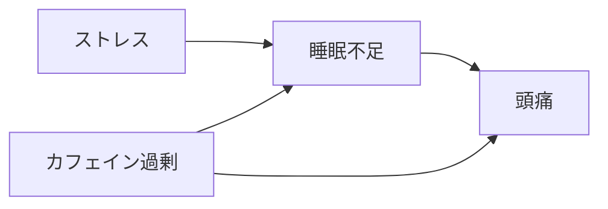
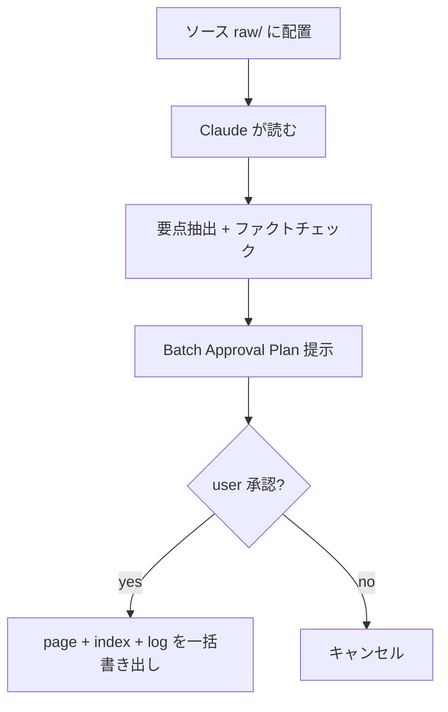
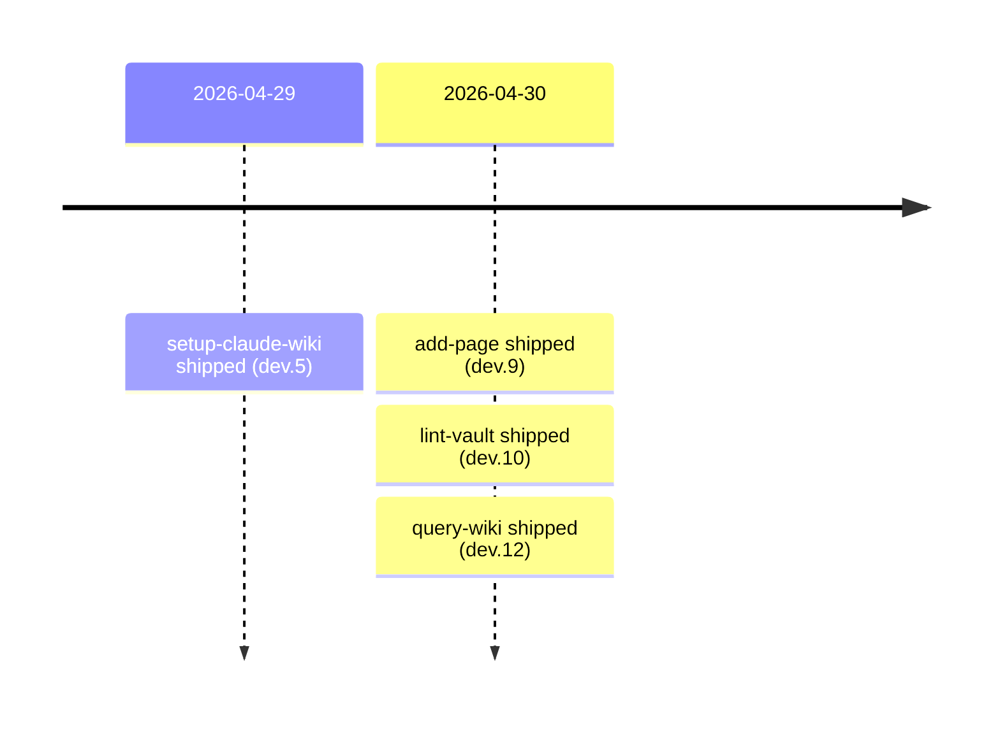
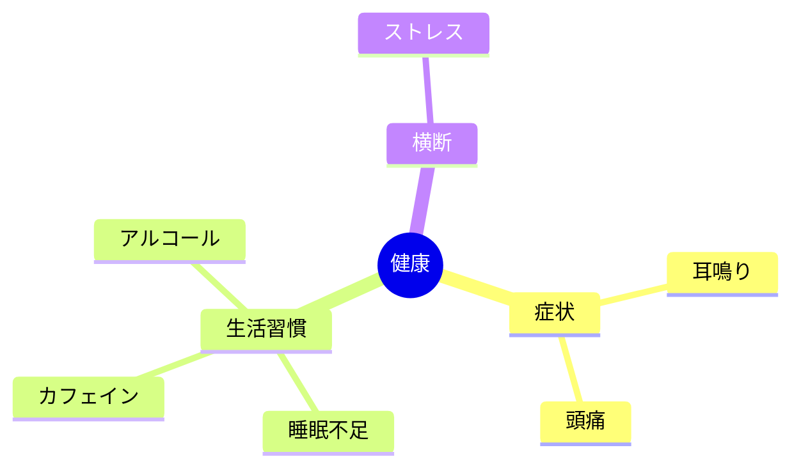

# Mermaid diagram examples for query-wiki

When a flow/relationship/timeline/visualization trigger fires in `query-wiki` Step 1.2, render a Mermaid block. Pick the diagram type that fits the question. The main SKILL.md links here from Step 3.3 — read this file when you need a concrete syntax pattern.

Mermaid syntax follows the Obsidian native renderer (Mermaid 10+). Each Mermaid block should be followed by a one-line `Sources: [[Page-1]] [[Page-2]] …` so provenance stays visible without the diagram having to encode it.

When unsure about the diagram type, default to `graph LR` for relationships or `flowchart TD` for processes.

## Concept relationships (`〜の関係`, `relationship between`)

````markdown

````

## Process flow (`〜の流れ`, `flow`, `flowchart`)

````markdown

````

## Timeline (`〜のタイムライン`, `timeline of`)

````markdown

````

## Mind map (organizing concepts under a root)

````markdown

````

## Pre-validate before emitting

Common mistakes that break Mermaid rendering:
- Reserved keywords as node names (`end`, `class`, `style`, `subgraph`) — rename or quote
- Missing arrow direction in `graph` declarations (use `LR`, `TD`, `BT`, `RL`)
- Special characters in node labels — wrap in `[Label]` brackets
- Unescaped quotes in labels — use `&quot;` or rephrase
